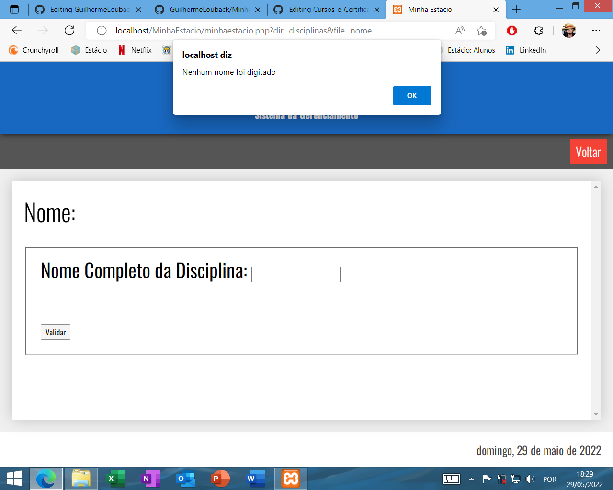
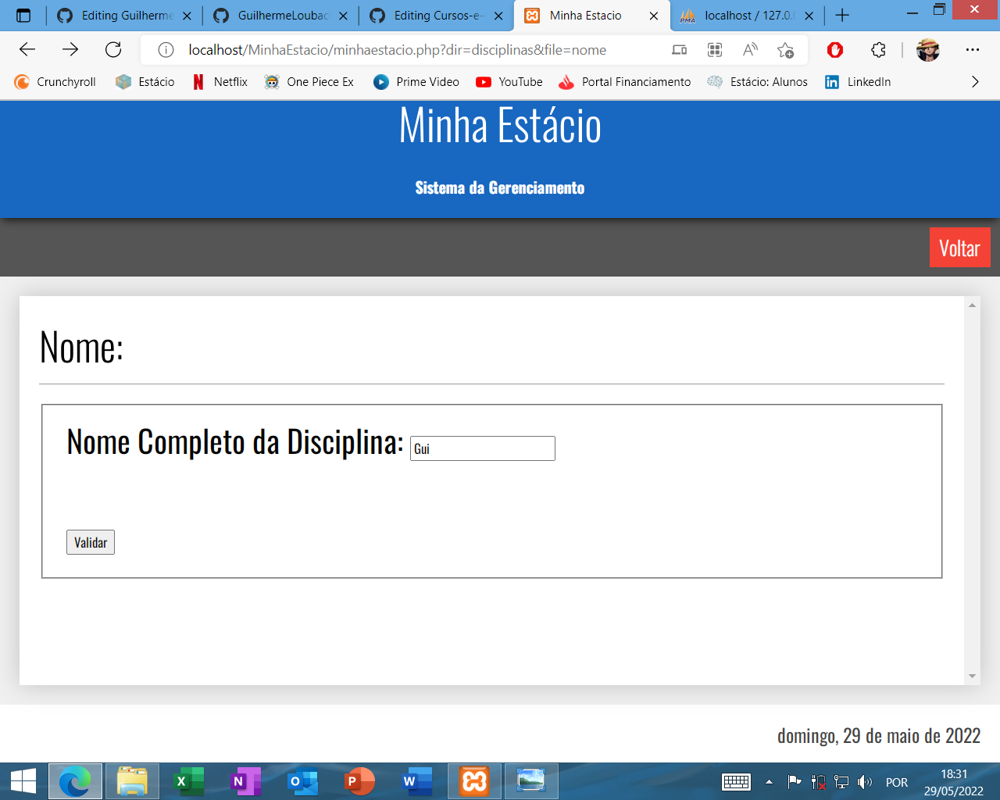
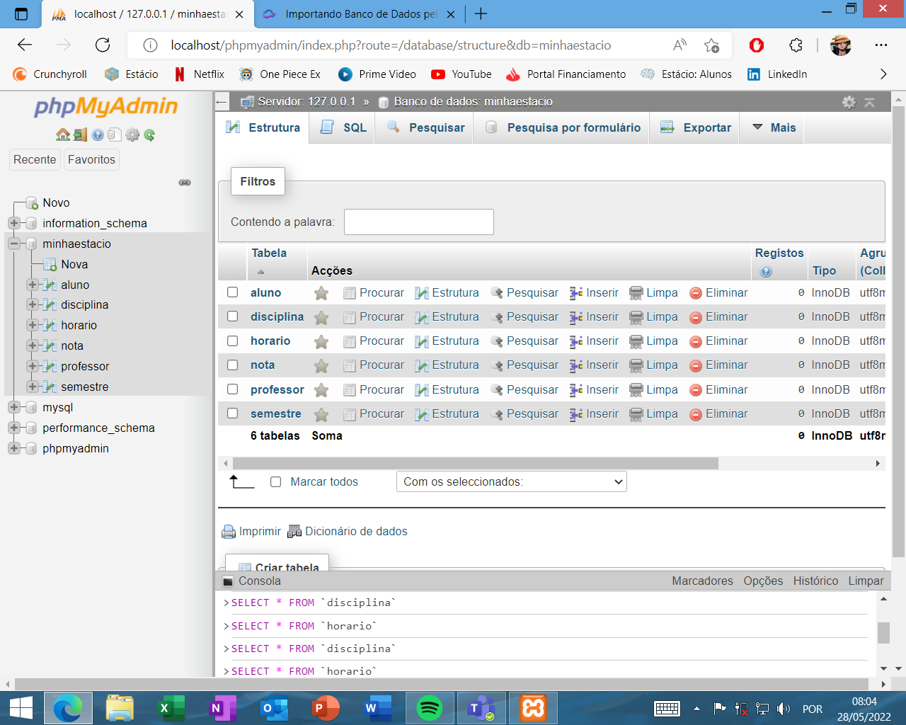
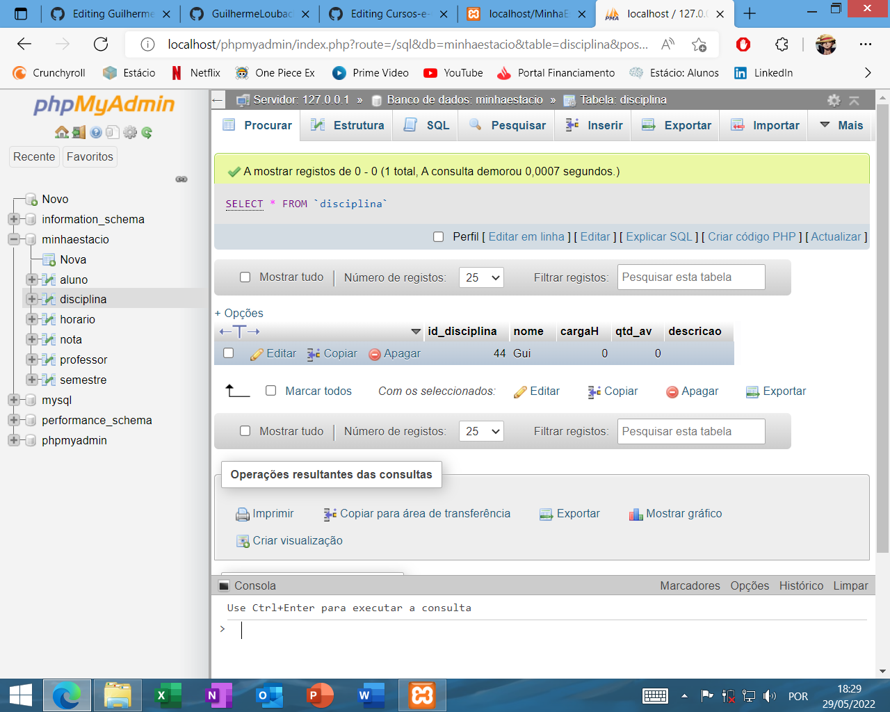

<h1>Projeto MinhaEstacio</h1>

<h5>O projeto tem por finalidade mostrar a integração de formularios com um DataBase gerenciada pelo <em>PHPMyAdmin</em>
  
  
  

<ul>
    <li>
    Manipulçao de DOM
    </li>
    <li>
    CRUD
    </li>
    <li>
    Manipulçao de DataBase
    </li>
    <li>
    Manipulçao de Arquivos
    </li>

</ul>
</h5>
  
<h5>INTERFACE DO SISTEMA CRIADA COM HTML,CSS e PHP</h5>
  

  

<h5>
VALIDAÇÃO DO FORMULARIO ADICIONAR DISCIPLINAS
 
Observação: O campo deve conter ao menos um caractere
</h5>
  

  

<h5>
ADICIONANDO ITEM NA TABELA DE DISCIPLINA DO BANCO DE DADOS 
</h5>
  

  

  

  

   

