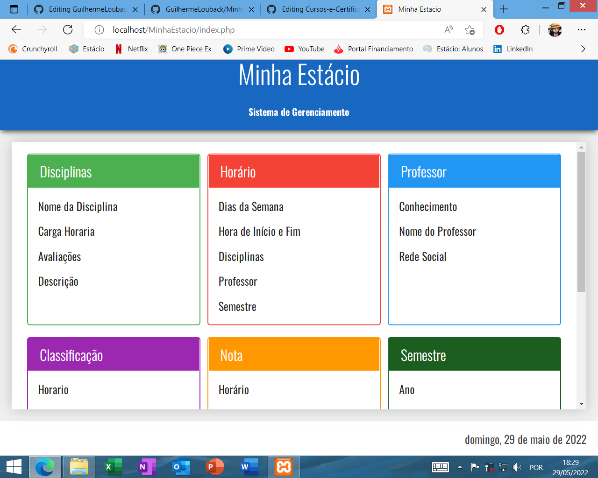

<h1>Projeto MinhaEstacio</h1>

<h5>O projeto tem por finalidade mostrar a integração de formularios com um DataBase gerenciada pelo <em>PHPMyAdmin</em>
  
  
  

<ul>
    <li>
    Manipulçao de DOM
    </li>
    <li>
    CRUD
    </li>
    <li>
    Manipulçao de DataBase
    </li>
    <li>
    Manipulçao de Arquivos
    </li>

</ul>
</h5>
  
<h6>Interface do programa criada com HTML,CSS e PHP</h6>
  

  

<h6>
Validação do formulario adiconar disciplina
 
Observação: O campo deve conter ao menos um caractere

</h6>
  

  

